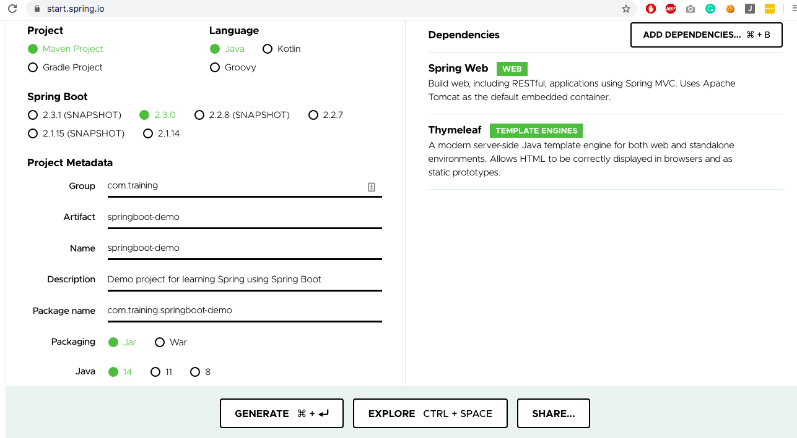

# Using Spring Boot - Course

* [Description](#description)
* [Objectives](#objectives)
* [Steps taken to setup the project](#steps-taken-to-setup-the-project)
* [License](#license)

## Description
Build a demo web app using Spring by following the course https://www.linkedin.com/learning/learning-spring-with-spring-boot-2.

## Objectives
Learn Spring by creating a demo app using Spring Boot.

- Creating a project with Spring Initializr
- Examining a Spring Boot skeleton project
- Using embedded databases for Spring Boot development
- Building a service abstraction
- Using the IoC paradigm in Spring to develop a service layer
- Building a controller
- Testing a controller MockMvc
- Exposing a service layer through REST

## Steps taken to setup the project
- Created project at https://start.spring.io/

## License
This project is licensed under the terms of the MIT License.
Please see [LICENSE](LICENSE.md) for details.
